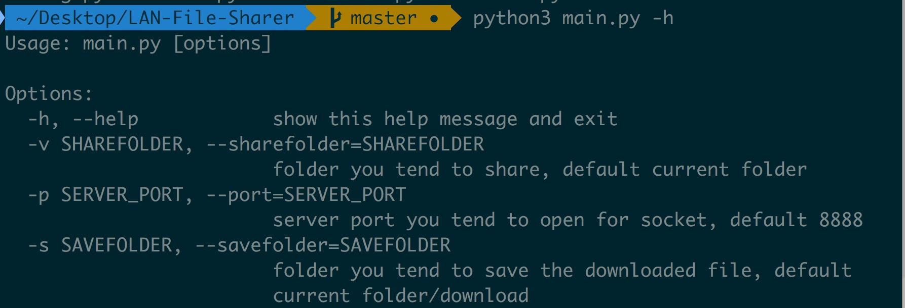
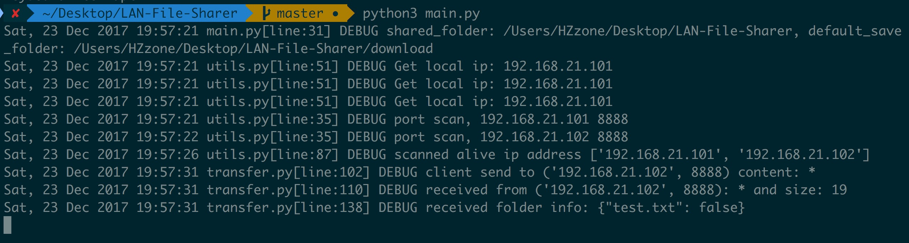
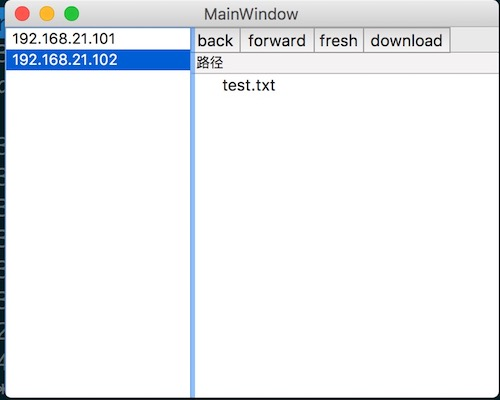
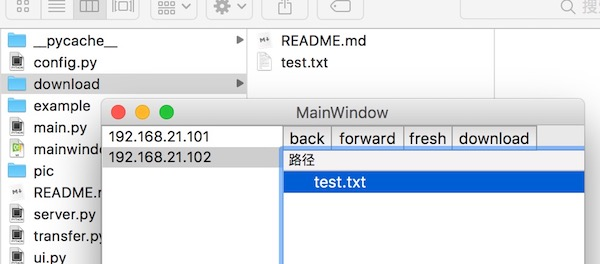

## File sharing based on python socket
### 项目选题
局域网文件共享
### 开发环境和工具
本项目[github地址](https://github.com/Hzzone/LAN-File-Sharer)  
我在macos，ubuntu 16.04下测试通过，基于python3，ui基于pyqt5，不需要其他依赖。只要安装完pyqt5，就能直接运行。

### 系统架构描述
1. 获取内网ip, 扫描局域网开启文件共享的服务器
2. 在本地用一个DHT数据库存储本机和局域网开启的服务器的文件共享信息，包括`key(文件目录)->value(ip地址)`
3. 作为服务器, 开启一个新线程循环接受和处理socket请求, 首先无论请求什么, 依次返回两条内容, 第一条是实际内容的大小, 第二条: 如果连接请求文件, 则返回文件字节流; 如果是文件夹, 则返回文件夹中的目录信息, 包括文件名, 是否是目录等.
4. 作为客户端, 开启新线程发送消息, 并循环接受服务器返回消息, 如果是文件, 则写入指定本地文件路径中, 并获取传输进度. 如果是目录, 则刷新ui.
5. UI部分, 基于PyQt.    
以上是基本思路.

两个主要线程，一个ui线程，另一个则是开启服务器共享的线程，接受socket请求。本项目基于udp编程。服务器线程循环接受消息，持续占用`config.server_port`端口（可以自行设置，见用户使用指南）。在传输文件信息或者文件时，则新建一个线程进行传输任务，传输完成进程就结束。  
在传递文件信息时，只传相对路径，不传输绝对路径。

### 用户手册
* 转化qt的.ui文件到.py文件:
```shell
python3 -m PyQt5.uic.pyuic $FileName$ -o $FileNameWithoutExtension$
```

* 如何使用
```shell
$ python3 main.py -h
Usage: main.py [options]

Options:
  -h, --help            show this help message and exit
  -v SHAREFOLDER, --sharefolder=SHAREFOLDER
                        folder you tend to share, default current folder
  -p SERVER_PORT, --port=SERVER_PORT
                        server port you tend to open for socket, default 8888
  -s SAVEFOLDER, --savefolder=SAVEFOLDER
                        folder you tend to save the downloaded file, default
                        current folder/download
```


通过各个参数设置软件的参数，包括：
    - 共享文件夹路径(默认当前文件夹)
    - 服务器端口号(默认8888)
    - 储存文件夹(默认源文件工程的download目录)
    - 在`config.py`中设置了默认参数

* 预览
运行时，会在命令行输出socket信息:


* UI介绍
**两台机器，一个局域网**
ui是基于pyqt5的，不是太熟所以比较丑。
* 左侧显示主机ip，右侧显示共享文件列表

* 双击文件之后再保存文件夹下找到自己下载的文件

